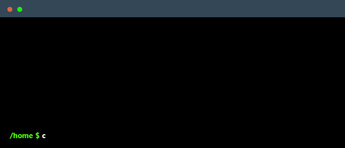

<h2> 𝐇𝐞𝐥𝐥𝐨 𝐭𝐡𝐞𝐫𝐞, 𝐟𝐞𝐥𝐥𝐨𝐰 <𝚍𝚎𝚟𝚎𝚕𝚘𝚙𝚎𝚛𝚜/>! </h2>

You have finally discovered my Github profile.  
Please feel free to clone/fork projects, raise issues and submit PRs if you think something could be better.  

mail <a href="mailto:srushtikhandelwal1205@gmail.com"><b>email</b></a> me.

<i>Happy Coding!</i> 😊

 
 
<i>Random dev joke for you! (create your own by clicking here ↓)</i> 

---

<i>Follow me around the web:</i> 

